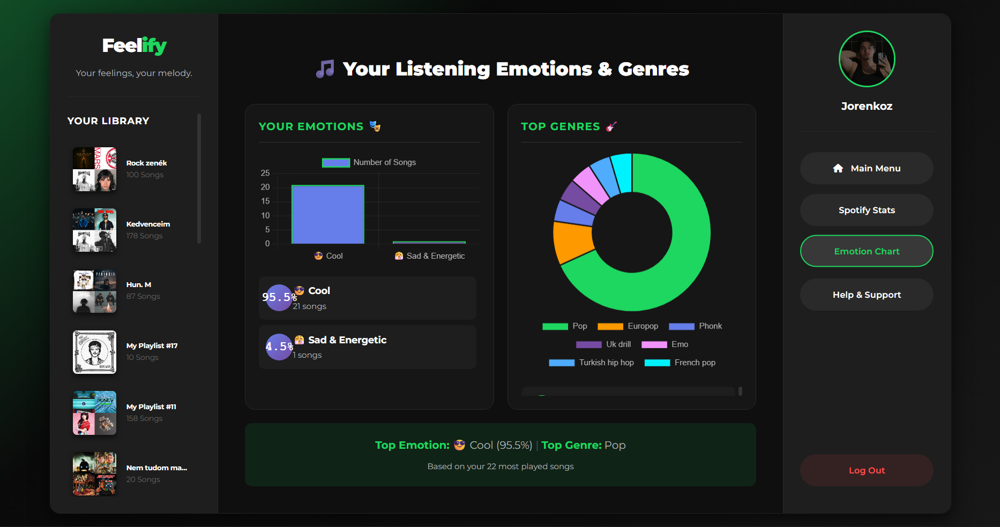
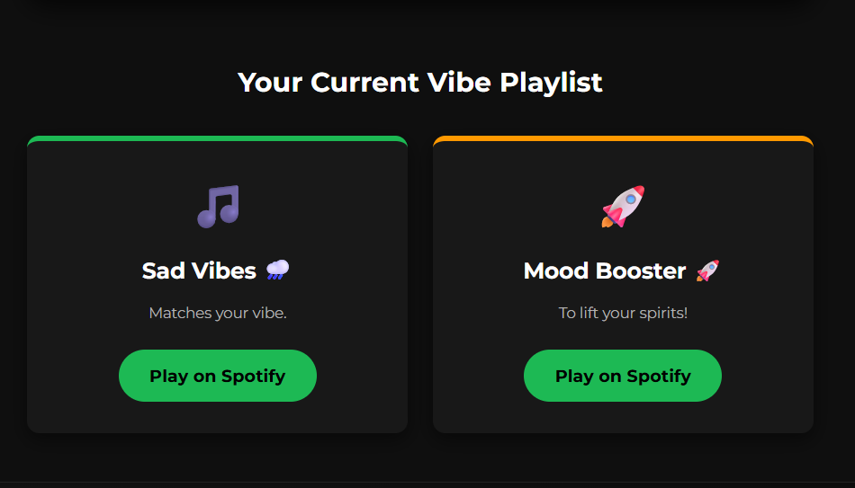
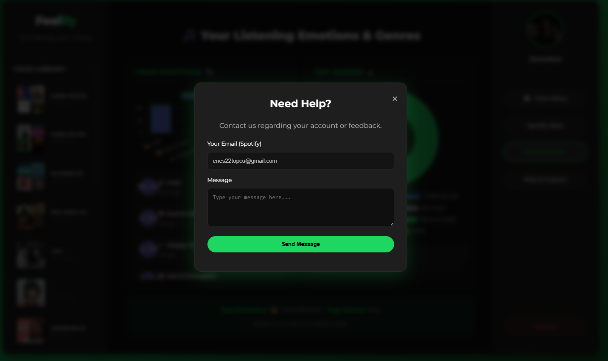

# Feelify 🎵📊

Feelify v2 is a full-stack web application that leverages the official **Spotify Web API** and **OAuth 2.0** authentication to analyze a user's recent listening history, map track audio metadata into emotional profiles, and dynamically render data visualizations alongside custom playlist curation.

---

## 🚀 Key Features & Engineering Milestones

- **Secure OAuth 2.0 Authentication Flow:** Engineered a bulletproof authentication cycle managing access and refresh tokens via secure cookies, ensuring seamless backend verification without compromising user security.
- **Algorithmic Emotion Profiling:** Interrogates Spotify track telemetry (including metrics like recent plays and top-tracked metadata) to visually render mood mapping and listener trends.
- **Dynamic Database Curation:** Implemented a robust **MongoDB + Mongoose** schema handling dynamic user profile synchronization using efficient MongoDB upserts (`findOneAndUpdate`) and user playlist preservation.
- **Automated Support Operations:** Built an embedded customer support system utilizing **Nodemailer**, which auto-generates randomized ticket IDs and handles multi-party secure dispatching via SMTP relays.

---

## 🛠️ System Architecture & Tech Stack

### Backend Architecture

- **Runtime Environment:** Node.js (v18+)
- **Web Framework:** Express.js (Restful API design, specialized cookie-parsing, and modular routing handlers)
- **Database Engine:** MongoDB & Mongoose ODM (Data modeling, indexing, and persistent state storage)
- **Integrations:** `spotify-web-api-node` SDK, Nodemailer

### Frontend Architecture

- Responsive vanilla JS UI, integrated asynchronous `fetch` abstractions, custom CSS layouts, and dynamic data-driven charts rendering client-side data analytics.

---

## 📸 Application Showcases

|                            Dashboard & Overview                            |                  Emotion Metrics & Visual Analytics                   |
| :------------------------------------------------------------------------: | :-------------------------------------------------------------------: |
|  |  |

|                               User Curation                               |                        Automated Support Tickets                         |
| :-----------------------------------------------------------------------: | :----------------------------------------------------------------------: |
|  |  |

---

## ⚙️ Local Development Setup

To run this project locally, ensure you have **Node.js** and **MongoDB** installed.

### 1. Repository Setup & Dependencies

```bash
git clone [https://github.com/Enes-Topcu/Feelify.git](https://github.com/Enes-Topcu/Feelify.git)
cd Feelify
npm install
```
