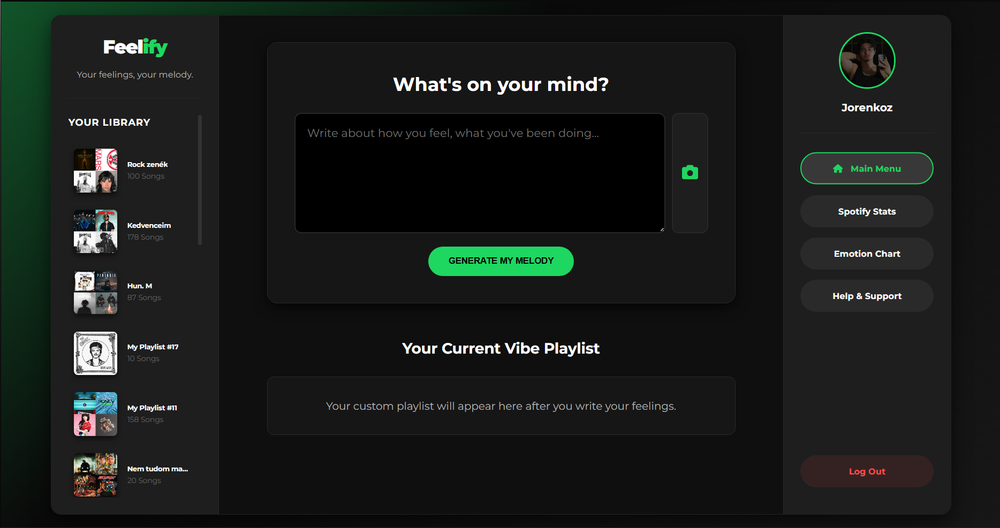

# Feelify — Full-Stack Music Analytics, Computer Vision Engine & Telemetry Dashboard 🎵📊👁️

Feelify is an advanced, production-ready web application designed to bridge real-time user biometrics, historical streaming telemetry, and automated cloud services. By integrating the official **Spotify Web API (OAuth 2.0)**, client-side **Computer Vision classification**, and persistent storage data layers, the platform maps immediate user affect states and historical consumption habits into deeply customized audio experiences.

---

## 🚀 Key Features & Engineering Milestones

- **Computer Vision Facial Emotion Recognition:** Processes real-time camera arrays via client-side facial land-marking models to calculate immediate affect states (e.g., Happy, Sad, Neutral) with dynamic coordinate tracking.
- **Dual-Branch Mood Remediation Controller:** When a low-valence state (such as **Sad**) is logged, the system executes concurrent compilation logic to deliver a dual-path layout:
  - _The Mirror Stream:_ Curates validation queues reflecting the current state.
  - _The Catalyst Stream:_ Generates a high-energy "Mood Booster" track matrix to elevate user valence metrics.
- **Deep Listening Telemetry Analytics (Stats Engine):** Queries deep personalization vectors from Spotify API endpoints (`/v1/me/top/tracks` and `/v1/me/top/artists`). The backend processes, cleans, and structures this raw JSON payload into an indexed, comprehensive "Monthly Vibe Check" layout ranking top historical tracks and artists.
- **Transactional Communication Gateway (Help & Support):** Engineered an encapsulated client-side feedback system driven by an Express router back-ended by automated **Nodemailer** SMTP relays. It aggregates live session states (such as active account emails) and routes inquiries securely with unique runtime identifier headers.
- **Stateful OAuth 2.0 Hardening:** Implemented a silent security token rotation process using isolated HTTP-only cookie structures to isolate app secrets and persist user contexts with zero client-side attack surface.

---

## 🛠️ System Architecture & Engineering Stack

                   ┌────────────────────────────────────────┐
                   │           Client Web Browser           │
                   └───────────────────┬────────────────────┘
                                       │
     ┌─────────────────────────────────┼─────────────────────────────────┐
     ▼                                 ▼                                 ▼

[ Biometric Interface ] [ Analytical Telemetry ] [ Secure Support Gateway ]
Real-time canvas capture Top Tracks & Artists API Transactional SMTP relay
& coordinate array parsing aggregations & data parsing asynchronous ticket tracking

### Core Technologies Used

- **Backend Core:** Node.js, Express.js (RESTful endpoint modeling, custom CORS controls, secure cookie-parsing engines).
- **Database Management:** MongoDB & Mongoose ODM (Using structured upsert metrics (`findOneAndUpdate`) to prevent document duplication).
- **Network & Integration Services:** `spotify-web-api-node` core client wrappers, secure Nodemailer SMTP transmission handling.

---

## 📸 Core UI Showcase & Visual Analytics

Below is the production-ready mapping of application views, matching our internal design system and live user workflows:

### 1. Main Hub & Dynamic Workspace Layouts

|                                              Default Workspace View                                              |                                 Core Navigation Controller                                  |
| :--------------------------------------------------------------------------------------------------------------: | :-----------------------------------------------------------------------------------------: |
|  width="410" alt="Feelify Workspace Empty State"/> |  |

### 2. Biometric Computer Vision Pipeline

|                               Live Canvas Stream Tracking                                |                                  Real-Time Geometry Analysis Engine                                   |
| :--------------------------------------------------------------------------------------: | :---------------------------------------------------------------------------------------------------: |
|  |  |

### 3. Deep Analytics, Telemetry Reporting & Support Operations

|                              Deep Consumption Analytics (Stats Engine)                               |                                     Aggregate Emotion Metric Charts                                     |
| :--------------------------------------------------------------------------------------------------: | :-----------------------------------------------------------------------------------------------------: |
|  |  |

|                           Managed Ticketing Modal (Help & Support)                           |                                Structured Dynamic Playlist Outputs                                 |
| :------------------------------------------------------------------------------------------: | :------------------------------------------------------------------------------------------------: |
|  |  |

---

## ⚙️ Local Development & Deployment

Ensure you have your runtime dependencies (**Node.js v18+** and a running instance of **MongoDB**) set up in your system environment before running the initialization pipeline.

### 1. Initialization

```bash
git clone [https://github.com/Enes-Topcu/Feelify.git](https://github.com/Enes-Topcu/Feelify.git)
cd Feelify
npm install
```
